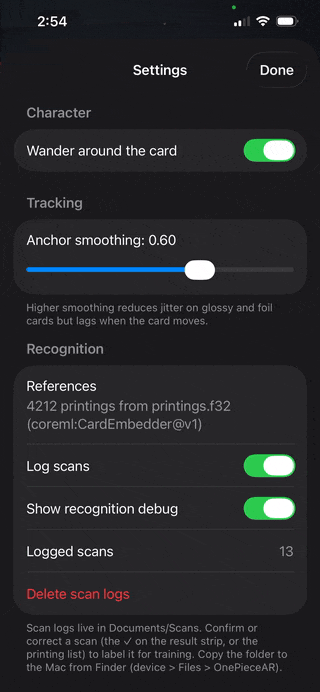

# One Piece Card Battle AR

An iPhone app that identifies the exact One Piece TCG card in front of the camera, out of 4,212
printings, fully on-device. The goal: the card's character comes alive on top of it in AR.

<table align="center">
  <tr>
    <td align="center"></td>
    <td align="center"></td>
  </tr>
  <tr>
    <td align="center">Baseline: Apple Vision feature print</td>
    <td align="center">My fine-tuned model (v1), on-device</td>
  </tr>
</table>

| | Apple Vision (baseline) | My model (v1) |
| --- | --- | --- |
| Closest **wrong** card's score, base / parallel | 0.797 / 0.750 | **0.301 / 0.361** |

*Same card number (PRB01-001), different art. Both models pick correctly, but mine leaves a far wider
gap to the runner-up. (These two cards were in v1's training scans.)*

## Why I built this

I love One Piece and wanted to learn more about ML and computer vision, so I picked a problem I
actually care about: telling apart cards that share a number and differ only in their art.

## Results

46 real iPhone scans of cards the model never trained on, matched against all 4,212 printings:

| Model | Top-1 printing (95% CI) | Top-3 |
| --- | --- | --- |
| Apple Vision feature print, no training | 63.0% (48.6–75.5%) | 78.3% |
| **Fine-tuned MobileNetV3 + CosFace (v1)** | **78.3% (64.4–87.7%)** | **87.0%** |

Preliminary: a small set, and the gain is concentrated in one card. Full results and caveats:
[`docs/results.md`](docs/results.md).

## How it works

```
camera frame ─► detect + rectify ─► OCR the card code ─► printings with that code ─► embedding picks one
                                          │ no code read
                                          └──────────────► nearest neighbor over all 4,212 printings
```

**Recognition (Swift, on-device)**
- **Detect:** Vision rectangle detection, then a perspective warp to a flat card crop.
- **Read the code:** Vision text recognition on the code corner (cropped, upscaled 3×). A code
  narrows 4,212 printings to a handful; if it maps to one printing, no ML is needed.
- **Match the art:** cosine nearest neighbor over a prebuilt index, one embedding per printing.
  New sets only need their art re-embedded, not retraining.
- **Art-check guard:** if a printing outside the code's group matches much better (margin 0.08),
  the code read is treated as an OCR mistake.

**Model (v1)**

| | |
| --- | --- |
| Backbone | MobileNetV3-Large (ImageNet) → linear → 256-d, L2-normalized |
| Loss | CosFace (scale 30, margin 0.25) over 4,212 classes |
| Data | 8 augmented views per printing per epoch (perspective, glare, blur, lighting) + 156 real scans ×4 |
| Batching | Printings that share a card code go in the same batch, so the loss separates siblings |
| Training | AdamW + one-cycle LR, 3 epochs, batch 64, PyTorch on a Mac mini M4 (MPS) |
| Deploy | Core ML, 224×320 RGB input; index is 4,212 × 256 float32 (4.3 MB) |

**Evaluation**
- **No leakage:** labeled scans are split by printing; ~30% of printings are test-only forever.
- **Frozen test sets:** versioned, ≥200 real scans across ≥30 printings, reported with 95% Wilson intervals.
- **Ship gate:** `make ship` refuses any model not evaluated on the current frozen set, and writes a model card.
- **One pipeline:** offline evals call the same Swift recognition code as the app (via a Mac CLI),
  so every number is what the phone would produce.

Details: [`docs/cv-pipeline.md`](docs/cv-pipeline.md), [`ml/README.md`](ml/README.md).

## Tech

- **App:** Swift 6, SwiftUI, ARKit, RealityKit, Vision, Core ML (iOS 18+)
- **ML:** Python, PyTorch, torchvision, coremltools, NumPy, pytest, uv

## Status

Recognition works end-to-end on the phone. AR summoning is in progress. My model runs in a dev build
and ships once the frozen test set (≥200 scans) exists.

## Run it

```sh
make test     # Swift unit tests
make ml-test  # ML lab tests
make open     # open in Xcode, then pick your team under Signing & Capabilities
```

Works without 3D assets (placeholder figures): see [`docs/asset-pipeline.md`](docs/asset-pipeline.md).

---

Unofficial fan project, not affiliated with or endorsed by Bandai, Shueisha, or Toei Animation.
Characters and card art are their IP and are never distributed.
