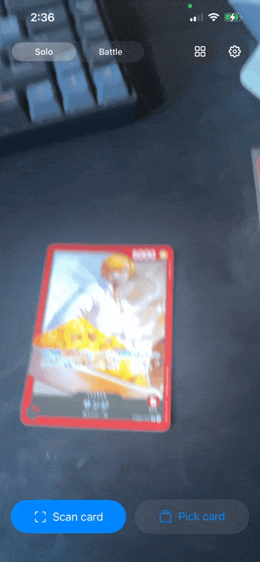
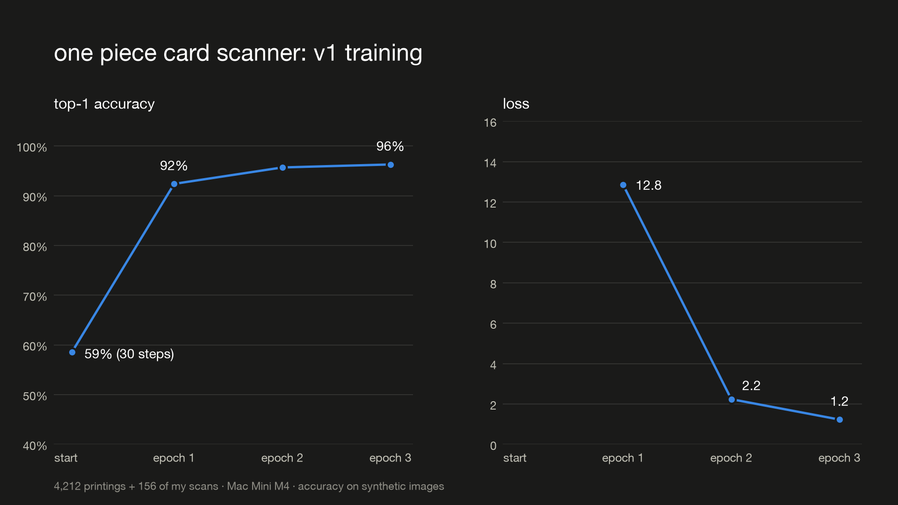

# One Piece Card Battle AR

Put a physical One Piece TCG card on the desk and its character comes alive on top of it,
in the card's specific form. A Gear 4 Luffy card spawns Gear 4 Luffy, and a Gear 5 printing
spawns Gear 5. Fully on-device, iPhone only.

<p align="center">
  
</p>

*Same card number, different art: the on-device scanner tells the base and parallel Sanji
(PRB01-001) apart. These are Japanese printings, matched against English catalog art. Recognition
debug is on: the top candidates and their similarity scores are shown at the top. Baseline model
(Vision feature print).*

**Status:** work in progress. Recognition runs end-to-end on the phone; summoning the character
onto the card is in progress. A fine-tuned embedding model is trained. On a preliminary set of
real phone scans it beats the untrained baseline (78% vs 63% top-1), and the headline comparison
is waiting on a large enough frozen test set (see [Results](#results)).

Unofficial personal fan project, not affiliated with or endorsed by Bandai, Shueisha, or Toei
Animation. Characters and card art are their IP. Assets are gitignored and never distributed.

## The hard part: telling printings apart

The catalog has about 4.2k printings. Many share a card code and differ only in art: base,
parallel (alt art), manga, and reprints. The app has to name the exact printing from a camera
frame in real time, offline, on a phone.

```
camera frame ─► detect + rectify ─► OCR the card code ─► printings with that code ─► embedding picks one
                (Vision rectangles)  (bottom-right crop)   (1 → done, no ML needed)    (nearest neighbor)
                                          │ no code read
                                          └──────────────► nearest neighbor over the whole catalog
```

- **Code first, embeddings second.** OCR narrows 4.2k printings to a handful, so the embedding
  only has to separate siblings. A guard checks that the art doesn't contradict the code: if a
  printing outside the group matches much better, the read is treated as an OCR mistake.
- **One pipeline, two places.** Recognition lives in a Swift package used by the app and by a Mac
  CLI. The Python lab calls that CLI instead of re-implementing anything, so every offline number
  is what the phone would produce.
- **Retrieval, not classification.** The index holds one embedding per printing. A new set means
  re-embedding its art, not retraining.

## ML

The Python lab (`ml/`) covers data, evaluation, training and shipping:

- **Baseline:** Apple Vision's feature print (`VNGenerateImageFeaturePrintRequest`), with no training.
- **Fine-tuned embedder:** MobileNetV3-Large (ImageNet) → 256-d embedding, trained with a
  CosFace loss in PyTorch on Apple Silicon (MPS), then exported to Core ML.
  - **Training data:** catalog art under on-the-fly augmentation (perspective error, glare,
    lighting, blur, JPEG, blurring the API's SAMPLE watermark), plus real phone scans oversampled.
  - **Group-aware batches:** printings that share a code go in the same batch, so the loss
    separates exactly the siblings the app confuses.
- **Data loop:** every scan on the phone is logged with the user's ✓ or correction as its label.
  Scans are imported on the Mac and split by printing, not by image: about 30% of printings are
  test-only forever, so no photo of a test card ever reaches training.
- **Evaluation discipline:**
  - Models are compared on a frozen, versioned real-scan test set, with 95% Wilson intervals.
  - A version can only ship after it's been evaluated on the current frozen set. Shipping writes
    a model card.
  - Synthetic scores are reported but marked as optimistic: synthetic photos are made from the
    same art as the references.

Details: [`ml/README.md`](ml/README.md), [`docs/cv-pipeline.md`](docs/cv-pipeline.md).

## Results

### Real phone scans (preliminary)

46 labeled iPhone scans of 8 printings that were never used for training, scored through the full
pipeline against all 4,212 printings (`make eval SCANS=test`):

| Model | Top-1 printing (95% CI) | Top-3 | Top-1 card number |
| --- | --- | --- | --- |
| v0: Vision feature print, no training | 63.0% (48.6–75.5%) | 78.3% | 67.4% |
| **v1: fine-tuned MobileNetV3 + CosFace** | **78.3% (64.4–87.7%)** | **87.0%** | **84.8%** |

On the same scans, v1 fixed 8 that v0 got wrong and broke 1. Read this with care:
- **The gain is concentrated:** 7 of the 8 fixes are scans of one card (OP01-120). Scans of the
  same card aren't independent, so this is a promising signal, not a proven win.
- **One card is still hard for both models** (OP11-067: 1 of 7).
- **OCR read a code on only 20% of these scans,** so most predictions came from the embedding alone.
  Better OCR on real cards is the next lever.

This pool isn't frozen and grows as I label scans. The headline comparison will use the first
frozen test set (≥200 scans across ≥30 printings), which is also what `make ship` requires.

### Synthetic photos and catalog images

Optimistic for the reason above:

| Setup | Index | Test images | Top-1 printing | Top-3 | Within-group |
| --- | --- | --- | --- | --- | --- |
| Vision feature print | 14 roster printings | 196 | 77.0% | 84.7% | — |
| Code-first + art guard, feature print | ~4.2k printings | 346 | 76.3% | 87.3% | 88.6% |

The fine-tuned embedder (v1: 4,212 printings + 156 real scans, 3 epochs on a Mac mini M4) reached
**96.3%** top-1 at the end of training. That is embedding-only nearest neighbor on augmented catalog
art (2 views per printing), not the full pipeline above, so the two numbers aren't comparable. The
real-scan comparison is the one that counts.



Full history: [`ml/results/results.csv`](ml/results/results.csv).

## Tech

- **App:** Swift 6, SwiftUI, ARKit, RealityKit, Vision, Core ML. iOS 18+.
- **Shared logic:** OnePieceKit Swift package (recognition math, catalog, battle rules), unit-tested on the Mac.
- **ML lab:** Python, PyTorch/torchvision, coremltools, NumPy, Pillow, uv, pytest.
- **Workflow:** a MacBook builds the app, and a Mac mini holds the datasets and trains (`make train`, `make eval`, `make ship`).

## Layout

```
apps/ios/            SwiftUI + ARKit + RealityKit + Vision app, plus OnePieceKit (pure Swift package)
data/cards/          cards.json, printings.json, variants.json (bundled into the app at build time)
ml/                  offline Python lab: data fetch, embeddings, evaluation, training, Core ML export
docs/                architecture.md, cv-pipeline.md, asset-pipeline.md
```

## Getting started

Requirements: Xcode 27, and an iPhone XS or newer running iOS 18+. The simulator has no ARKit,
but the card browser and settings still run there.

```sh
make test     # OnePieceKit + BattleKit unit tests, no device needed
make build    # compile the app for a generic iPhone, unsigned
make open     # open in Xcode
make ml-test  # ML lab unit tests
make eval NAME=v0   # evaluate a model version on the frozen test set (see ml/README.md)
```

To run on your phone: open the project, go to Signing & Capabilities for the OnePieceAR target,
choose your team (and change the bundle ID if it's taken), then run on the device.

### First run without any assets

The app works with no 3D models at all. Each variant spawns a colored placeholder figure with
the same behavior (idle, attack, hit, victory, wander), so you can test AR before the asset
pipeline exists.

1. **Pick card** > Summon. With no card art bundled, tap a surface to place the character.
2. Add card art as `apps/ios/OnePieceAR/Resources/Cards/<printingId>.png`. The character then
   anchors to the physical card, and **Scan card** starts recognizing it.
3. Add a model as `Resources/Characters/<variant>.usdz` plus clips (see
   `docs/asset-pipeline.md`), and the placeholder is replaced by the rigged character.

Card data comes from the OPTCG API. The roster has two cards so far. See `docs/architecture.md`
and `data/cards/README.md`.
